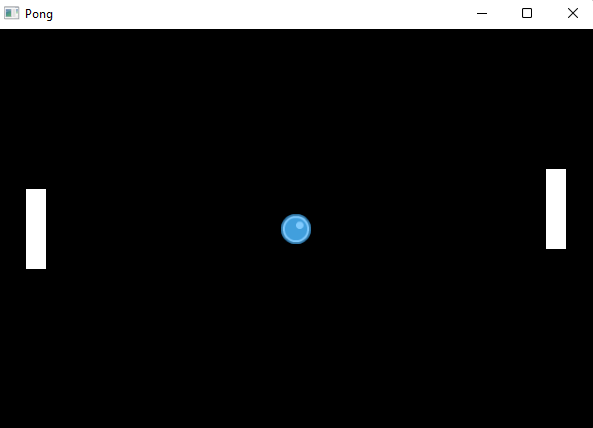

## Pong

Classic game of [Pong](https://en.wikipedia.org/wiki/Pong). Created with [Bevy](https://bevyengine.org/).

<!-- Display image stored in preview/game.png -->


### How to run

```bash
# Clone the repository
git clone https://github.com/marshblocker/pong.git

# Change directory
cd pong

# Run the game
cargo run
```

### Controls

-   `W` and `S` to move the left paddle
-   `Up` and `Down` to move the right paddle